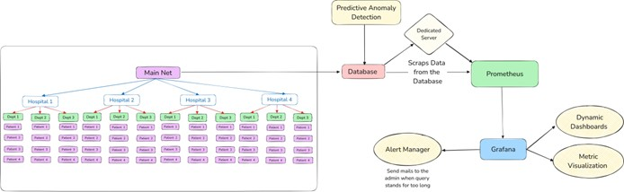
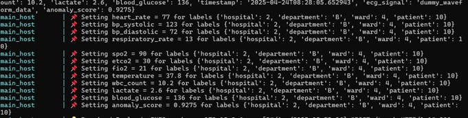
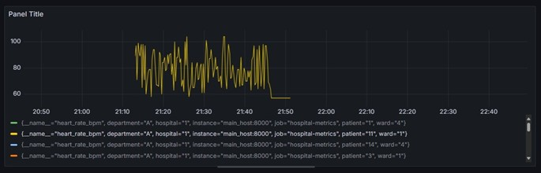
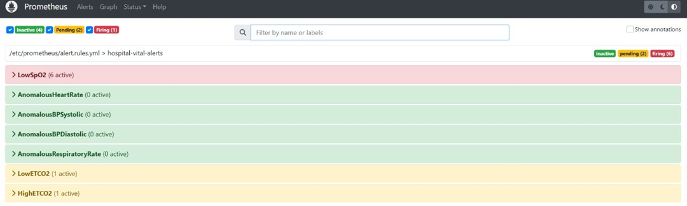

# Cloud-Based Network Traffic Monitoring and Anomaly Detection for Healthcare Infrastructure




## 🩺 Project Overview


This project provides a scalable, Dockerized monitoring system designed for cloud-based healthcare infrastructures. It simulates a multi-tier hospital network and collects real-time medical metrics (SpO2, heart rate, ECG, etc.) from patient devices. The system is deployed on AWS and leverages Prometheus, Grafana, and Alertmanager to visualize and alert on anomalies.

> 🔍 Focused on ensuring reliability, real-time observability, and early anomaly detection within hospital networks using cloud-native tooling.

---

## ⚙️ Features

- 🚑 **Healthcare-specific metric simulation**: Heart rate, SpO2, BP, etc.
- ☁️ **Cloud-native deployment** on AWS EC2 using Docker.
- 📈 **Prometheus-based metric scraping** with 5s interval.
- 📊 **Grafana dashboards** for visualization (per ward, department, patient).
- 🚨 **Alertmanager** with threshold-based anomaly detection.
- 🧠 **ML-based anomaly detection** pipeline for vitals.

---

## 🧱 Project Structure

```
CN_Project/
│
├── services/                   # All application services
│   ├── main_host/              # Central metrics collection service
│   ├── ml_service/             # Anomaly detection service
│   └── patient_simulator/      # Patient data simulation
│
├── config/                     # All configuration files
│   ├── prometheus/             # Prometheus and alerting config
│   ├── alertmanager/           # Alert routing configuration
│   ├── grafana/                # Grafana dashboards and datasources
│   └── environment/            # Environment-specific configs
│
├── data/                       # Data storage
│   └── patient_samples/        # Patient data samples
│
├── scripts/                    # Utility scripts
│   ├── setup.sh                # Setup script
│   └── deploy_aws.sh           # AWS deployment script
│
├── docs/                       # Documentation
│   ├── Images/                 # Documentation images
│   ├── AWS_Deployment_Report.md
│   └── API.md                  # API documentation
│
├── docker-compose.yml          # Main docker-compose file
└── README.md
```

---

## 🚀 Deployment Instructions

### Prerequisites

- Docker & Docker Compose
- AWS EC2 (Ubuntu)
- Python 3.9+

### Step-by-Step Guide

1. **Clone the repository**
   ```bash
   git clone https://github.com/KMohnishM/CN_Project.git
   cd CN_Project
   ```
   
2. **Run the setup script**
   ```bash
   chmod +x scripts/setup.sh
   ./scripts/setup.sh
   ```

3. **Launch the system**
   ```bash
   docker-compose up --build
   ```

4. **Access interfaces**
   - Prometheus: `http://localhost:9090`
   - Grafana: `http://localhost:3001`
   - AlertManager: `http://localhost:9093`

---

## 📊 Dashboards







- Real-time ECG, HR, and SpO2 dashboards
- Department-wise heatmaps
- Alert timelines and incident patterns

---

## ⚠️ Alerting Rules (Prometheus)

```yaml
groups:
  - name: hospital-vital-alerts
    rules:
      - alert: LowSpO2
        expr: spo2_percent < 90
        for: 1m
        labels:
          severity: critical
        annotations:
          summary: "Low SpO2 for patient {{ $labels.patient_id }}"
          description: "SpO2 below 90% for more than 1 minute."
```

---

## 🧪 Simulated Metrics

- Heart Rate (BPM)
- Blood Pressure (Systolic/Diastolic)
- SpO2 (%)
- Respiratory Rate
- ECG waveform (synthetic)
- FiO2 (%), EtCO2, WBC Count, Glucose, Lactate

---

## 📦 Future Improvements

- Enhanced ML-based anomaly detection
- Consolidated web dashboard interface
- Kubernetes-based orchestration
- Federated monitoring for multi-hospital use
- Real-time collaboration and logging pipeline

---

## 🧠 Author

**Kodukulla Mohnish Mythreya**  
2nd Year CSE, VIT Vellore  
[LinkedIn](https://linkedin.com/in/kmohnishm) | [GitHub](https://github.com/KMohnishM)

---

## 📜 License

This project is open-sourced under the MIT License. See [LICENSE](./LICENSE) for more details.
